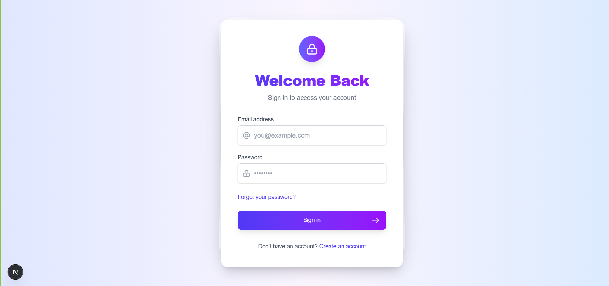

# React Authentication System

A complete, secure, and adaptable authentication system built with Next.js and Express. This project provides a robust foundation for implementing user authentication in any web application.

<div align="center">
  
</div>

## Features

- **Secure User Authentication**: Registration, login, and session management
- **JWT-based Authorization**: Secure token-based authentication
- **Password Management**: Reset and recovery workflows
- **User Profile System**: View and update user information
- **Protected Routes**: Client and server-side route protection
- **Responsive Design**: Mobile-friendly UI built with Tailwind CSS
- **MongoDB Integration**: Secure storage for user data
- **Full-Stack Solution**: Next.js frontend + Express backend

## Screenshots

<div align="center">
  <h3>Authentication Pages</h3>
  
  
</div>

<div align="center">
  <h3>User Features</h3>
  
  
</div>

## Tech Stack

### Frontend
- **Next.js 15.2.3** with App Router architecture
- **React 19.0.0** for UI components
- **Tailwind CSS 4.0** for styling
- **Axios** for API requests
- **JWT-Decode** for token handling
- **React Hook Form** for form validation

### Backend
- **Node.js** runtime environment
- **Express** web framework
- **MongoDB** with Mongoose ODM
- **JWT** for authentication
- **Bcrypt** for password hashing
- **Passport.js** for JWT strategy
- **Express Validator** for input validation

## Getting Started

### Prerequisites

- Node.js (v16+)
- MongoDB (local instance or MongoDB Atlas)
- npm or yarn package manager

### Installation

1. Clone the repository:
```bash
git clone https://github.com/yourusername/auth-system.git
cd auth-system
```

2. Install dependencies for both client and server:
```bash
npm run install-deps
```

3. Environment Setup:
   - Create a `.env` file in the server directory with the following variables:
   ```
   MONGO_URI=your_mongodb_connection_string
   JWT_SECRET=your_jwt_secret_key
   JWT_EXPIRE=30d
   ```
   - Create a `.env.local` file in the client directory:
   ```
   NEXT_PUBLIC_API_URL=http://localhost:5000/api
   ```

4. Start the development servers:
```bash
npm run dev
```

This will concurrently run both the client (Next.js) on port 3000 and the server (Express) on port 5000.

## Project Structure

```
auth-system/
├── client/               # Next.js frontend
│   ├── public/           # Static files
│   └── src/
│       ├── app/          # Next.js App Router pages
│       └── context/      # Context API providers
├── server/               # Express backend
│   ├── config/           # Server configuration
│   ├── controllers/      # Request handlers
│   ├── middleware/       # Custom middleware
│   ├── models/           # Mongoose schemas
│   └── routes/           # API routes
└── images/               # Documentation assets
```

## Authentication Flow

1. **Registration**: Users create an account with email and password
2. **Email Verification**: (Mock implementation - can be extended)
3. **Login**: JWT tokens issued upon successful authentication
4. **Authorization**: Protected routes check token validity
5. **Token Refresh**: Automatic token refreshing
6. **Password Reset**: Secure password recovery flow

## API Endpoints

### Auth Routes
- `POST /api/auth/register` - Register a new user
- `POST /api/auth/login` - Log in a user
- `GET /api/auth/me` - Get current user
- `POST /api/auth/forgot-password` - Request password reset
- `PUT /api/auth/reset-password/:token` - Reset password with token

### User Routes
- `PUT /api/users/profile` - Update user profile

## Security Features

- **Password Encryption**: Passwords hashed using bcrypt
- **JWT Authentication**: Stateless auth using secure tokens
- **Input Validation**: Server-side validation with Express Validator
- **Protected Routes**: Client and server-side route protection
- **HTTP-Only Cookies**: Enhanced security for token storage (can be enabled)

## Future Enhancements

- Email verification
- OAuth integration (Google, Facebook, etc.)
- Two-factor authentication
- Role-based access control
- Account management features

## License

This project is licensed under the ISC License.

## Acknowledgements

- [Next.js](https://nextjs.org/)
- [React](https://reactjs.org/)
- [Express](https://expressjs.com/)
- [MongoDB](https://www.mongodb.com/)
- [Tailwind CSS](https://tailwindcss.com/)
- [Passport.js](http://www.passportjs.org/)
